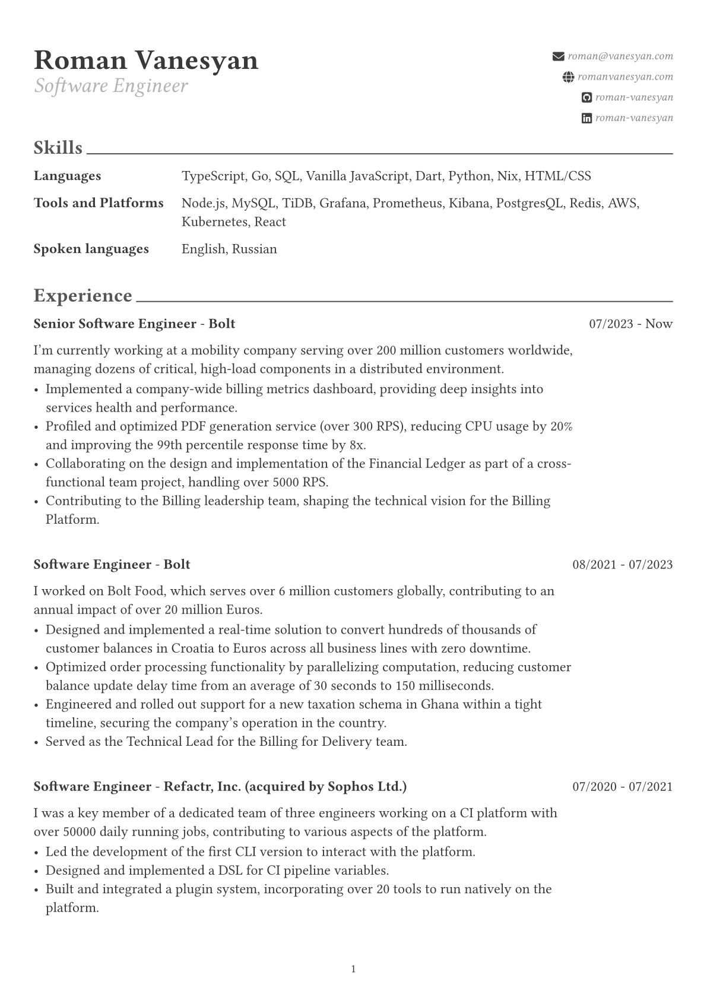

# Curriculum Vitae



This repository hosts an automated system for generating my CV.
The template, written in Typst, is modular and composed of reusable
components. Feel free to fork it and adapt it to your needs.

The core philosophy of behind this repository is to design the CV structure once
and then use it in an append-only fashion for future updates.

## Release

GitHub Actions automatically schedules a new Release when a tag in the `vx.y.z` format is created.
A special `latest` release always reflects the most recent version of the CV.

## Build

To build the project, you'll need to install [Typst](https://typst.app).

Once installed, use the following command to build:

```
$ typst build cv.typ
```

For continuous building on file changes, use:

```
$ typst watch cv.typ
```

### Nix

For Nix users, the project includes a flake configuration file that provides
two convenient commands:

```
$ cv build
$ cv watch
```

## License

This project is licensed under the MIT License.
